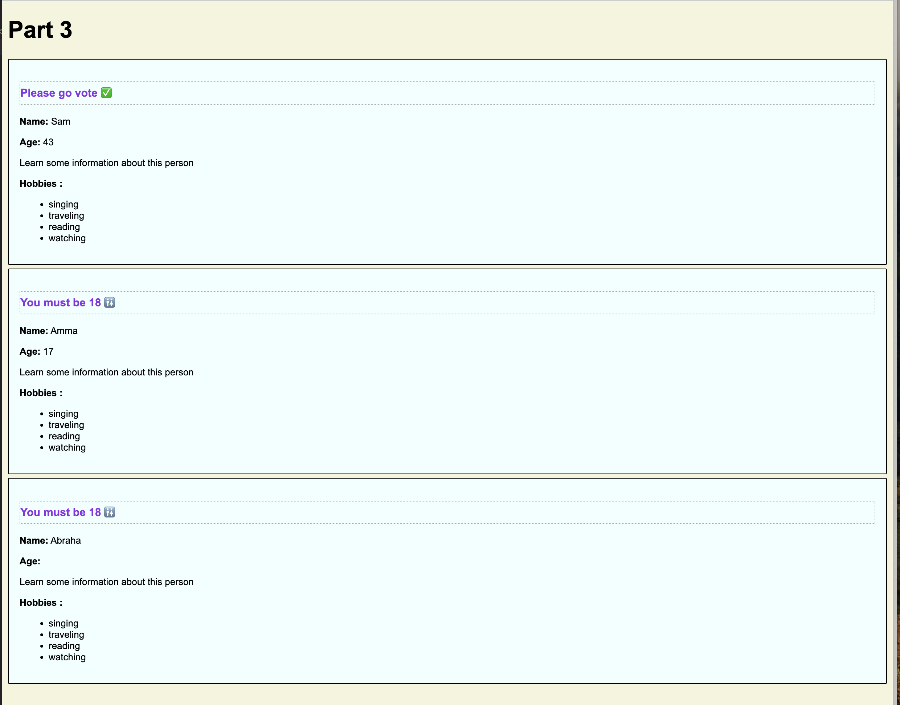

# Solution Overview

This solution addresses the task of creating React components to represent individuals and tweets. Here's a summary:

## Part 1: Component Introduction

- Developed two components:
  - **FirstComponent**: Displays an introductory message.
  - **NamedComponent**: Displays a personalized message using a provided name.
- These components are integrated within the **App** component.

## Part 2: Tweet Representation

- Implemented a **Tweet** component representing a tweet, including user details and a message.
- Applied CSS styling to the **Tweet** component.
- The **App** component renders at least three instances of the **Tweet** component.

## Part 3: Person Representation

- Introduced the **Person** component to showcase individual information.
- Displays name, age, and hobbies of a person.
- Includes logic to prompt voting if the person is over 18 and truncates long names to six characters.
- The **App** component renders at least three instances of the **Person** component.

This solution illustrates the creation of nested components, prop passing, and CSS styling in a React environment.

